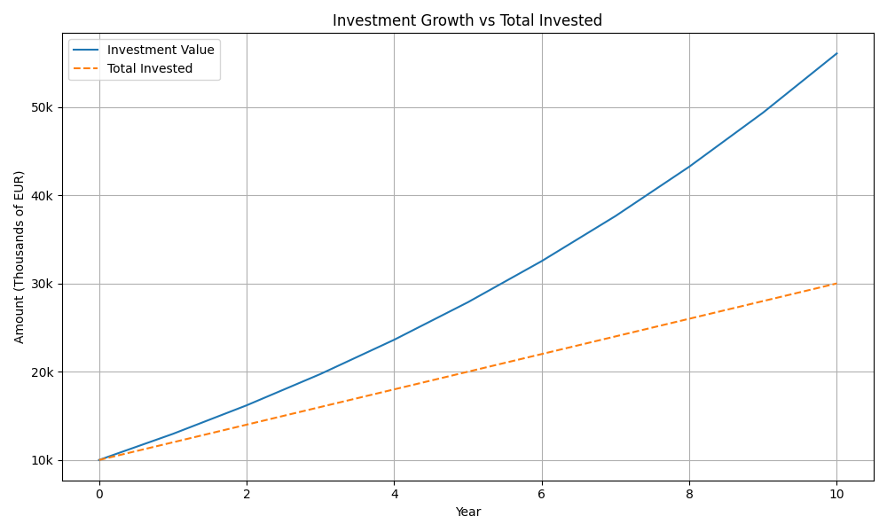

# Investment Growth Calculator 📈

This is a simple Python project that simulates the growth over time of an investment portfolio based on user inputs such as:

- Investment type: ETF/Fund, individual stock, or derivative
- Initial capital and yearly contributions
- Expected return and dividend yield
- Fees (expense ratio, broker fees, spread)
- Dividend reinvestment options

It produces a detailed breakdown of the investment's evolution year by year and plots the total investment contribution vs. the simulated investment value.

---

##  About the Project

This project was originally created in Java after my first year of university during 2023. It was later rewritten and improved in Python.

What started as a basic calculator to estimate how an investment would grow with annual contributions has evolved into a modular simulator that separates logic across files and now includes:

- Plotting with `matplotlib`
- Option to save the simulation output in a TXT

This is one of my first projects where I applied programming to personal investment planning.

---

##  How to Run

1. **Clone the repository:**

```bash
git clone https://github.com/AlbertPerez7/Investment-Growth-Calculator.git
cd Investment-Growth-Calculator
```
2. **Install dependencies:**

```bash
pip install -r requirements.txt
```

3. **Run the simulation:**

```bash
python main.py
```

---

##  Example of Execution

```
📊 Welcome to the Investment Calculator

Select investment type:
1. Fund/ETF
2. Individual Stock
3. Derivative
Enter choice (1/2/3): 1
Enter initial capital: 10000
Enter annual contribution: 2000
Enter number of years: 10
Enter expected average compound annual growth rate (CAGR) (in %): 9
Enter average annual dividend yield (in %): 1
Enter fund manager's expense ratio (in %): 0.5
Reinvest dividends? (yes/no): yes

...

💰 Total contributed: 30000.00
📈 Total value after 10 years: 56051.46
🟢 Net profit before taxes: 26051.46

📥 Do you want to save all results as shown to a TXT file? (y/n): y
Enter filename (e.g., results.txt): MundialEtf
✅ Results saved to 'MundialEtf'
```

---

## Example Plot



---

## 📁 Project Structure

```
Investment-Growth-Simulator/
├── Investment/
│   ├── calculator.py
│   ├── inputs.py
│   └── plotter.py
├── example_outputs/
│   ├── example_output.png
│   └── mundialEtf.txt
├── main.py
├── requirements.txt
└── README.md
```


---

##  Features

- Interactive CLI prompts
- Investment evolution breakdown by year
- TXT output saving
- Visualization of money invested vs. investment value

---
